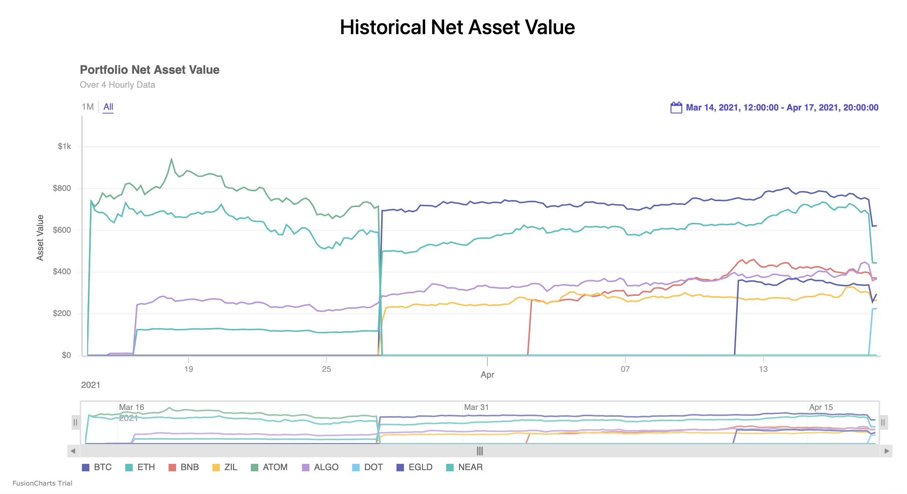
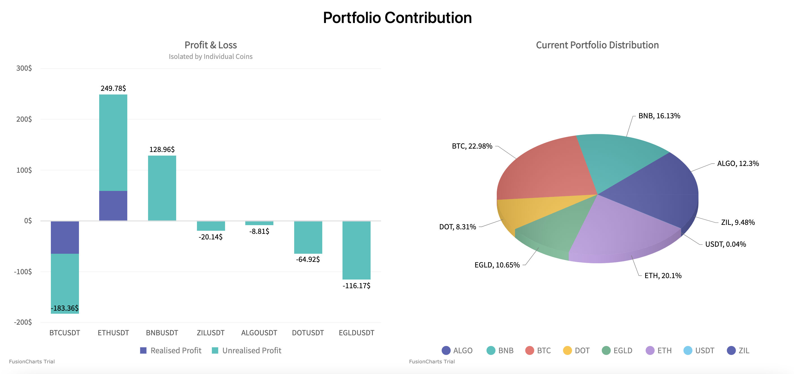
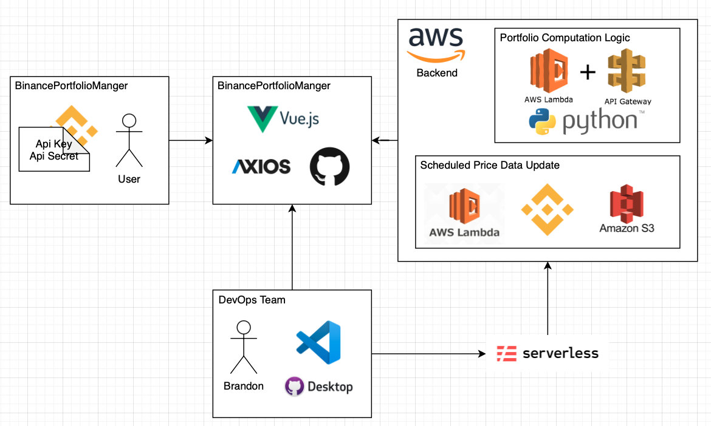

# BinancePortfolioManager

   

## Problem Statement & Solution

Bianance application does not provide an easy way for users to track the P&L of their portfolio. This is especially evident when you move holdings from SPOT to EARN. The BPM (Binance Portfolio Manager) website seeks to provide a solution for this, giving users an easy way to monitor their holdings and track P&L. Additional functionalities such as portfolio optimization will be included along the way.

## Release Schedule

<table>
    <thead>
        <tr>
            <th>Expected Date</th>
            <th>Release Build</th>
            <th>Description</th>
          <th>Functionalities</th>
        </tr>
    </thead>
    <tbody>
        <tr>
            <td>31 May 2021</td>
            <td>Pre-Release</td>
            <td>Closed group testing to gather UX feedback and identify bugs</td>
            <td rowspan="2">Dashboard to view portfolio P&L efficiently</td>
        </tr>
        <tr>
            <td>30 June 2021</td>
            <td>Production</td>
            <td>Open usage by Binance community and handle live workloads</td>
        </tr>
        <tr>
            <td>31 July 2021</td>
            <td>New Feature</td>
            <td>Portfolio Optimisation Module</td>
            <td>Optimise your crypto portfolios and leverage minimum variance strategies</td>
        </tr>
    </tbody>
</table>

### Current Progress

Track the progress via this [Kanban Board](https://github.com/brandontjd/BinancePortfolioManager/projects/1)

#### Sample Charts

## Proposed Architecture

<ol>
  <li>The service will be hosted on GitHub</li>
  <li>Frontend: Written in Vue.JS</li>
  <li>Backend: Python REST APIs deployed on Lambda</li>
  <li>No database will be used, as we will not store user information. With user API credentials, python-binance API will pull all required account data.</li>
  <li>Hourly Lambda scheduled jobs will be ran to pull latest prices into s3 bucket for BPM to access, instead of relying on user API access.</li>
  <li>Users are to generate Binance API Keys (with trading function switched off) and for the website. </li>
</ol>

## Collaboration
By no means am I a professional in this, if you would like to collaborate, please ping me on my email and we can discuss. Thanks! 

## Disclaimer
This project is primarily for my personal usage and a decision to open source it to help the investing community better leverage binance. All views and findings presented in my code or repository are my own and do not represent the opinions of any entity whatsoever with which I have been, am now, or will be affiliated. All material provided are for general information purposes only and do not constitute accounting, legal, tax, or other professional advice. Visitors should not act upon the content or information found here without first seeking appropriate advice from an accountant, financial planner, lawyer or other professional. Usage of any material contained within this repository constitutes an explicit understanding and acceptance of the terms of this disclaimer.
